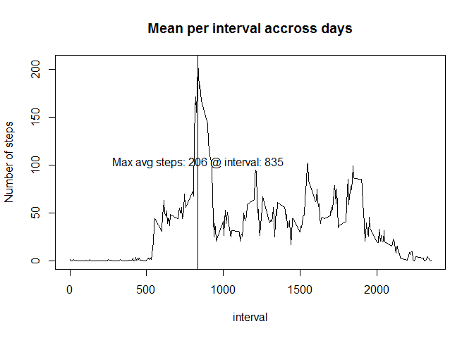

# Reproducible Research: Peer Assessment 1


## Loading and preprocessing the data


```r
# NOTE1: activity.csv must be in the same folder as where this Rmd file is run from
# NOTE2: This was developed in RStudio where dplyr package is already installed. 
# Load the dplyr library since we will be using the group_by and summary functions
# Load activity.csv using read.csv and assign to a variable activities
library("dplyr")
activities <- read.csv("activity.csv")
```

## What is mean total number of steps taken per day?


```r
# use group_by to group the data by date and then use summary function with sum() to calculate 
# total number of steps take per day
bydate <- group_by(activities,date)
stepsperday <- summarize(bydate,StepsPerDay=sum(steps, na.rm=TRUE))
# Barplot is a graph with bars (vertical or horizontal), where each bar represents a category. It it used for comparison between categories.
# Histogram is a distribution of numerical data over time. Here we will use histogram function to show steps per day over all of the days in the data set
hist(stepsperday$StepsPerDay,col="blue",main="Steps per day - Missing values ignored", xlab="Steps per day")
```


```r
# calculate mean and median of the total number of steps taken per day
mean <- mean(stepsperday$StepsPerDay)
median <- median(stepsperday$StepsPerDay)
cat("mean: ",mean,"median: ", median)
```

```
## mean:  9354.23 median:  10395
```


## What is the average daily activity pattern?
### Average daily pattern:


```r
# use group_by to group by the 5 minute interval and then use summarize to calculate mean of steps accross all days for each of the 5 minute intervals
byinterval <- group_by(activities,interval)
meanaccrossdays <- summarize(byinterval,Mean=round(mean(steps,na.rm=TRUE)))
# use plot on meanandmedian to generate a time series plot of the 5-minute interval (x-axis) and the average number of steps taken, averaged across all days (y-axis)
plot(meanaccrossdays$interval,meanaccrossdays$Mean,type="l",xlab="interval",ylab="Number of steps",main="Mean per interval accross days")
# use filter to return the row that is the maximum number of steps
maxavgsteps <- filter(meanaccrossdays,Mean == max(Mean))
# now draw the vertical line to show the maximum number of steps
abline(v=maxavgsteps$interval)
# display the max
label <- paste("Max avg steps:", maxavgsteps$Mean, "@ interval:", maxavgsteps$interval )
text(maxavgsteps$interval+5,maxavgsteps$Mean/2,label)
```




## Imputing missing values

```r
# Calculate and report the total number of missing values in the dataset (i.e. the total number of rows with NAs)
missingvalues <- filter(activities,is.na(steps))
cat("# of Missing Values: ",dim(missingvalues)[1])
```

```
## # of Missing Values:  2304
```

```r
# use the mean values from meanaccrossdays data frame to fill in the NAs
for (row in 1:dim(missingvalues)[1])
  missingvalues[row,1] = meanaccrossdays[meanaccrossdays$interval==missingvalues[row,3],2]

# missingvalues
# now update activities to fill in missing values
activities[is.na(activities$steps),1] = missingvalues[missingvalues$interval==activities[is.na(activities$steps),3],1]
missingvaluesafter <- filter(activities,is.na(steps))
cat("# of Missing Values: ",dim(missingvaluesafter)[1])
```

```
## # of Missing Values:  0
```

```r
bydate <- group_by(activities,date)
stepsperday <- summarize(bydate,StepsPerDay=sum(steps, na.rm=TRUE))
# Here we will use histogram function to show steps per day over all of the days in the data set with missing values imputed
hist(stepsperday$StepsPerDay,col="blue",main="Steps per day - Missing values imputed",xlab="Steps per day")
```


```r
# calculate mean and median of the total number of steps taken per day
mean <- mean(stepsperday$StepsPerDay)
# display it
median <- median(stepsperday$StepsPerDay)
cat("mean: ",mean,"median: ", median)
```

```
## mean:  10765.64 median:  10762
```
### After imputing there is a better distribution of the values in the histogram accross the intervals. Also, the frequency of values at the mean have increased. The mean has also increased.


## Are there differences in activity patterns between weekdays and weekends?
### Yes, there are difference in activity patterns between weekdays and weekends as you can see below 

```r
activities$day <- weekdays(as.Date(activities$date))
weekend <- filter(activities,grepl("Saturday",activities$day) | grepl("Sunday",activities$day))
weekdays <- filter(activities,!grepl("Saturday",activities$day) & !grepl("Sunday",activities$day))

byinterval_weekdays <- group_by(weekdays,interval)
meanaccrossweekdays <- summarize(byinterval_weekdays,Mean=round(mean(steps,na.rm=TRUE)))
# use plot on meanaccrossweekdays to generate a time series plot of the 5-minute interval (x-axis) and the average number of steps taken, averaged across all week days (y-axis)
plot(meanaccrossweekdays$interval,meanaccrossweekdays$Mean,type="l",xlab="interval",ylab="Number of steps",main="Mean per interval accoss weekdays")
```


```r
byinterval_weekend <- group_by(weekend,interval)
meanoverweekend <- summarize(byinterval_weekend,Mean=round(mean(steps,na.rm=TRUE)))
# use plot on meanoverweekend  to generate a time series plot of the 5-minute interval (x-axis) and the average number of steps taken, averaged over weekend days (y-axis)
plot(meanoverweekend$interval,meanoverweekend$Mean,type="l",xlab="interval",ylab="Number of steps",main="Mean per interval over weekend")
```


